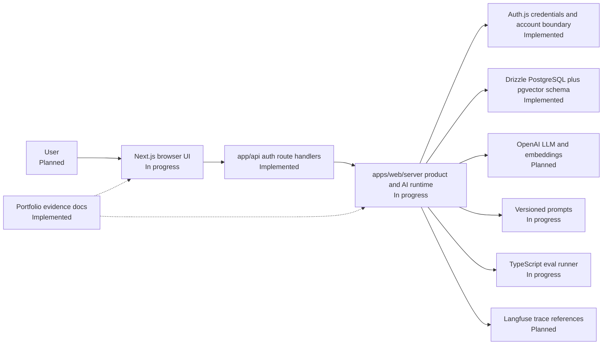
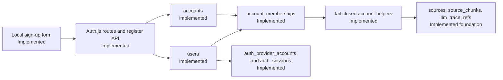
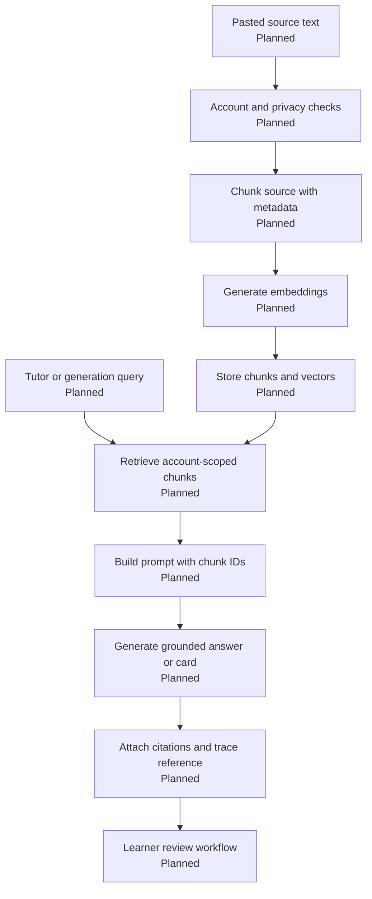
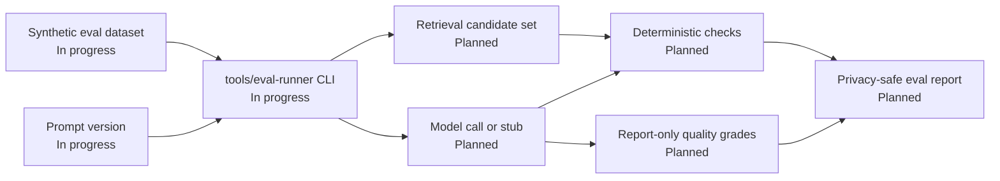
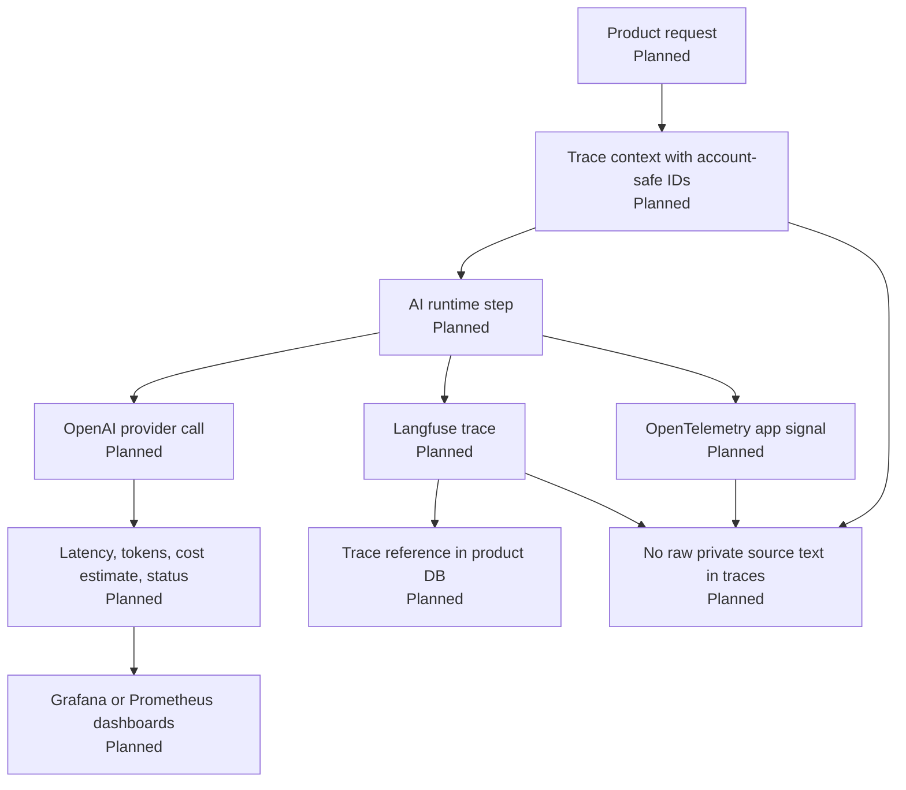

# Architecture Diagrams

These diagrams are portfolio evidence, not implementation claims. Labels show whether a boundary is Implemented, In progress, Planned, or Deferred.

## Status Legend

| Status | Meaning |
|---|---|
| Implemented | Present in the repo today as governance, scaffold, config, or documentation. |
| In progress | Scaffolded or documented, but not yet a complete product feature. |
| Planned | Accepted v1 direction, not yet implemented as product behavior. |
| Deferred | Outside v1 until an ADR or later roadmap item changes scope. |

## Current and Planned System Architecture

## Implemented Auth and Account Data Foundation

## Planned RAG Flow

## Planned Eval Flow

## Planned Observability Flow

